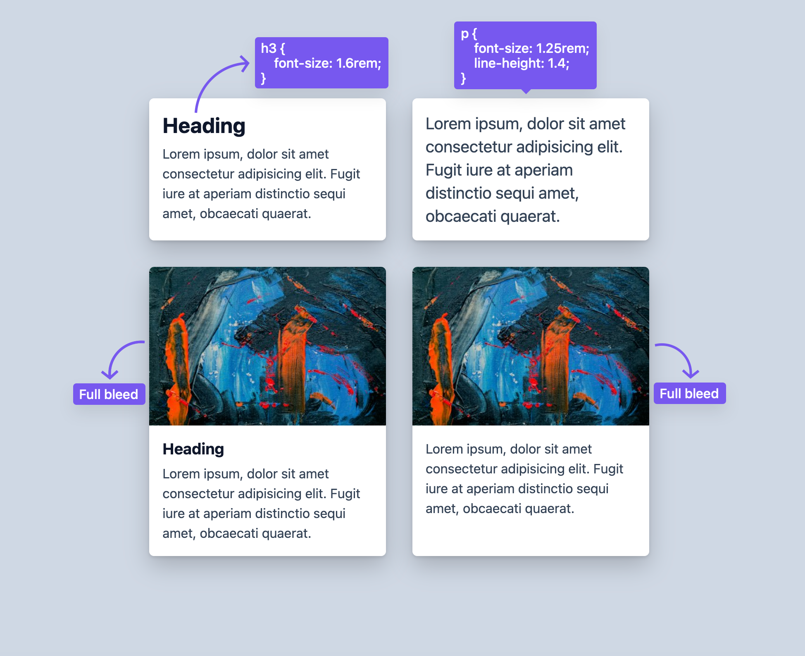

# No Classes (relationel styling med `:has()`)

## Formål

At træne brugen af `:has()` til at style komponenter ud fra deres indhold og struktur i stedet for ekstra CSS-klasser.

Målet er ikke “aldrig at bruge klasser”, men at lære, hvornår en relationel selector gør CSS mere vedligeholdelsesvenlig og HTML’en renere.

## Ressourcer

- [`:has()` i praksis](https://demos.cssxs.dev/topic/3sem/crafting-ui/has) (Kursusmateriale)
- [`:has()` (MDN)](https://developer.mozilla.org/en-US/docs/Web/CSS/:has)

## Opgavebeskrivelse

Du skal arbejde med denne branch, som består af et HTML-dokument med kort (`cards`) med varierende indhold:

- overskrift
- tekstafsnit
- og/eller billede

Din opgave er at style kortene i `style.css` ved hjælp af **`:has()`** i kombination med `:not()`, så kortene reagerer på deres indhold.

Målet er at undgå ekstra “klasser” i HTML, når informationen allerede findes i markup’en.

## Krav til styling (se referencebillede)

Kortene skal styles forskelligt ud fra deres indhold:

1. **Kort uden billede**
   - Overskriften (`h3`) skal være større (som vist i referencebilledet).

2. **Kort, der hverken har et billede eller en overskrift**  
   (dvs. kort med kun paragraftekst)
   - Paragrafteksten (`p`) skal have justeret typografi:
     - `font-size: 1.25rem`
     - `line-height: 1.4`

3. **Kort med billede**
   - Billedet skal være **full bleed** (gå helt ud til kortets kanter).
   - Kortets tekstindhold skal stadig flugte med den samme indvendige padding som de øvrige kort.

Brug `:has()` (og `:not()`) til at sætte reglerne op.

> [!NOTE]
> `:not()` betyder: **ikke**.
> Når du kombinerer den med `:has()`, kan du læse det som: **“vælg elementer, som ikke har …”**
>
> ```css
> section:not(:has(h2)) {
>   opacity: 0.7;
> }
> ```

Se billedet for reference.

> Referencebilledet viser fire varianter af samme kort:
>
> - uden billede + med overskrift
> - uden billede + uden overskrift
> - med billede + med overskrift
> - med billede + uden overskrift



> [!WARNING]  
> **Bemærk, at denne branch IKKE inkluderer et CSS Reset.**

## Faglige forventninger

Din løsning skal vise, at du kan:

- bruge `:has()` til at style parent/komponent ud fra indhold
- kombinere `:has()` med `:not()` når det giver mening
- holde selectors læsbare
- løse opgaven uden ændringer i HTML-strukturen

### Instruktioner

- Skriv dine styles i `style.css`
- Ændringer i HTML-strukturen er **ikke** tilladt

## Aflevering

Find link til din løsning på Netlify og aflever det på Fronter.

Link-struktur: **no-classes--**[Dit unikke netlify link].netlify.app/
