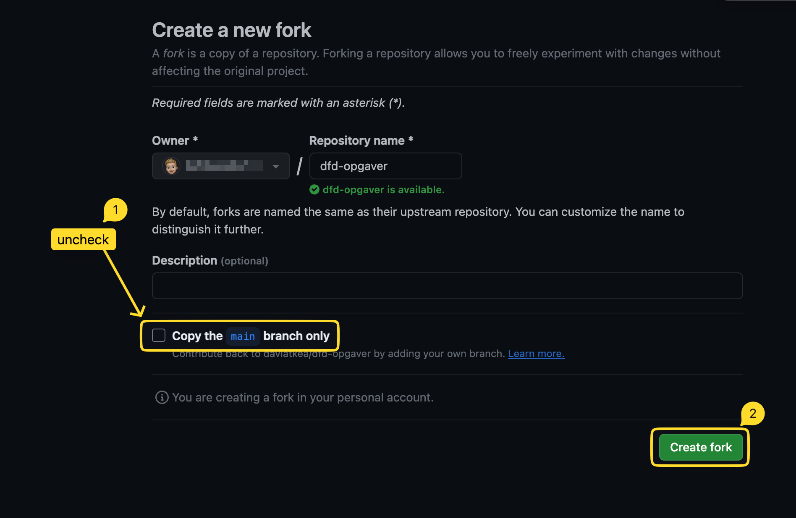
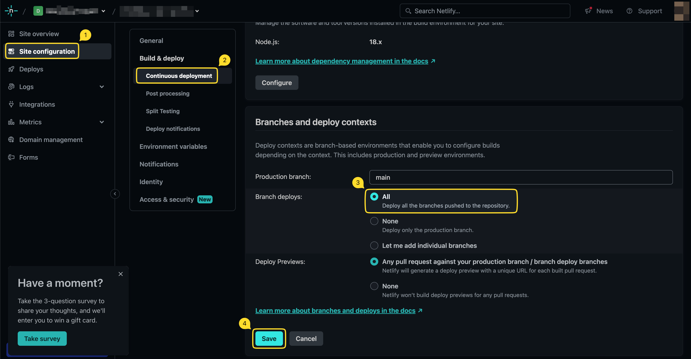

# Frontend Design - Opgaver

> [!IMPORTANT]  
> Følg instruktionerne, før du kloner.

## Instruktioner

<details>
<summary>1. Fork alle branches (fold ud for at se hvordan)</summary>



</details>

2. Klon det forkede repository

<details>

<summary>3. Forbind med Netlify og sørg for, at deployment sker fra alle branches (fold ud for at se mere)</summary>



</details>

Du er nu klar til at gå i gang med opgaverne. Når du skal lave en øvelse, så vælg denne ved at skifte til den relevante branch (se liste over øvelser nedenfor).

### Netlify-indstillinger

Brug disse indstillinger som udgangspunkt:

- Production branch: `main`
- Branch deploys: alle branches
- Build command: lad feltet være tomt
- Publish directory: `.`

De fleste øvelser er statiske HTML/CSS-projekter, og de kan derfor deployes direkte fra roden af branchen. Astro-øvelserne indeholder deres egen `netlify.toml`, som sætter `npm run build` og `dist` for de branches, der har brug for et build-step.

En branch bliver typisk tilgængelig på en URL i dette format:

```txt
branch-navn--site-navn.netlify.app
```

## Opgaveoversigt (via branches)

### Selectors

- No Classes ("no-classes")

### Layout

- Makro-layout med full-bleed ("makrolayout")
- Grid Breakout ("breakout")
- Scrolling Container ("scrolling-container")
- Subgrid Caption ("subgrid-caption")
- Subgrid Card ("subgrid-card")
- Responsive Container ("responsive-container")
- Responsive Album ("responsive-album")

### UI Patterns

- Flow Space-teknikken ("flow-space")
- Styling af tekstindhold ("text-styling")
- Card UI ("card-ui")
- Animated Accordion w/ details/summary ("details-accordion")

### Code in the Dark

- Code in the Dark 1 ("citd-1")
- Code in the Dark 2 ("citd-2")

## Ressourcer

- [CSS Reset](/resources/reset.css)
- [CSS Patterns](/resources/patterns.md) (Opdateres løbende...)
- [CSS Anti-Patterns](/resources/anti-patterns.md) (Opdateres løbende...)
