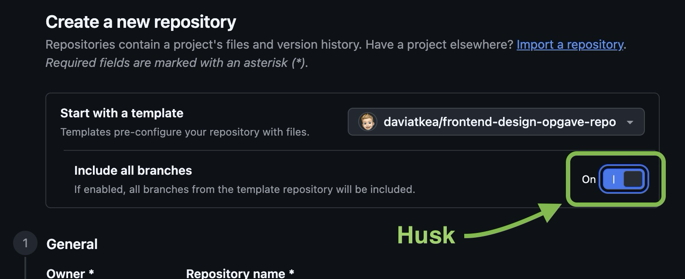

# Frontend Design - Opgaver

> [!IMPORTANT]  
> Brug **Use this template** og vælg **Include all branches**. Du skal ikke forke eller klone repoet.

## Kom i gang

1. Klik på **Use this template** øverst til højre.
2. Vælg **Create a new repository**.
3. Giv repoet et navn, fx `frontend-design-opgaver`.
4. Vigtigt: Sæt flueben ved **Include all branches**.
   
5. Klon dit nye repository til din computer.

6. Forbind projektet med Netlify (https://netlify.com) og sørg for, at deployment sker fra alle branches. Se nedenfor:

   

Du er nu klar til at gå i gang med opgaverne. Når du skal lave en øvelse, så vælg denne ved at skifte til den relevante branch (se liste over øvelser nedenfor).

En branch bliver typisk tilgængelig på en URL i dette format:

```txt
branch-navn--site-navn.netlify.app
```

## Opgaveoversigt (via branches)

### Selectors

- No Classes ("no-classes")

### Layout

- Makro-layout med full-bleed ("makrolayout")
- Grid Breakout ("breakout")
- Scrolling Container ("scrolling-container")
- Subgrid Caption ("subgrid-caption")
- Subgrid Card ("subgrid-card")
- Responsive Container ("responsive-container")
- Responsive Album ("responsive-album")
- Bento Grid ("bento-grid")

### UI Patterns

- Flow Space-teknikken ("flow-space")
- Styling af tekstindhold ("text-styling")
- Card UI ("card-ui")
- Animated Accordion w/ details/summary ("details-accordion")

### Moderne CSS og progressive enhancement

- Relative Color Syntax ("relative-color")
- Anchor Positioning ("anchor-positioning")
- @supports og reel fallback ("supports-fallback")

### CSS-arkitektur

- CSS-arkitektur: ansvar før mapper ("css-architecture")

### Code in the Dark

- Code in the Dark 1 ("citd-1")
- Code in the Dark 2 ("citd-2")

## Ressourcer

- [CSS Reset](/resources/reset.css)
- [CSS Patterns](/resources/patterns.md) (Opdateres løbende...)
- [CSS Anti-Patterns](/resources/anti-patterns.md) (Opdateres løbende...)
