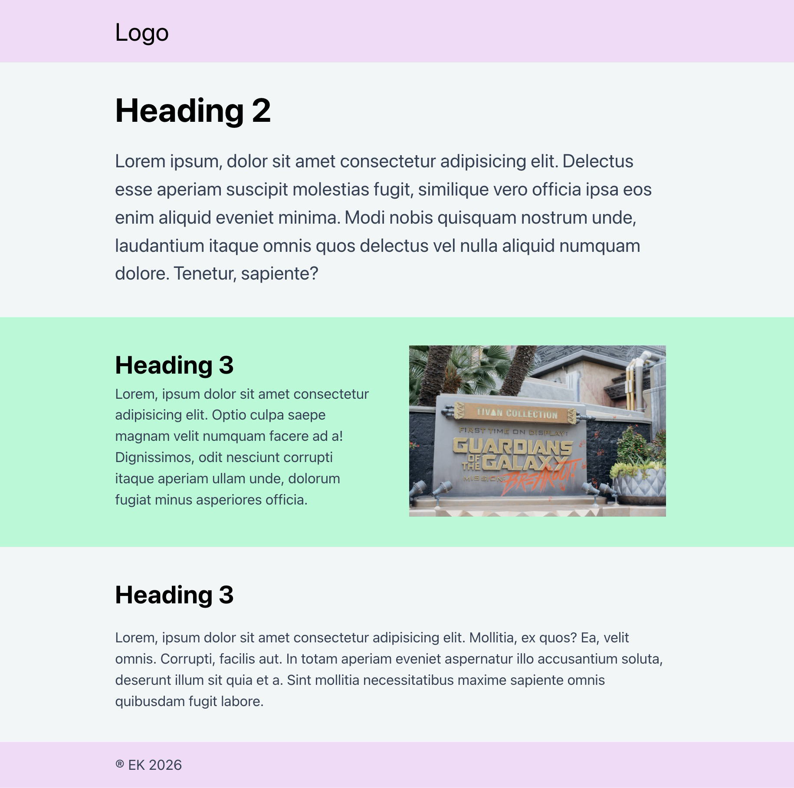

# Makro-layout med `subgrid`

## Formål

At bygge et robust side-layout med **CSS Grid + `subgrid`**, hvor:

- almindelige sektioner ligger i en normal indholdskolonne (`content`)
- én udvalgt sektion (`.breakout`) bryder ud i et bredere spor (`full`)

Målet er at træne en vedligeholdelsesvenlig layoutstruktur med navngivne linjer og delt kolonnelogik.

## Ressourcer

- [`Subgrid`](https://demos.cssxs.dev/topic/3sem/crafting-ui/responsive/subgrid)
  - [`Makro-layout med full-bleed`](https://demos.cssxs.dev/topic/3sem/crafting-ui/responsive/subgrid#%C3%B8velse-2)
- [Subgrid-øvelser](https://cssxs.dev/subgrid)

## Opgavebeskrivelse

Du arbejder i denne branch med eksisterende HTML og CSS.

Din opgave er at tilføje regler for layoutet i `style.css`.

Du skal bygge et makro-layout, hvor:

- siden har navngivne grid-linjer til mindst:
  - `content` (normal læsebredde)
  - `full` (bredere / full-bleed område)
- relevante wrappers/sektioner arver kolonnerne via `subgrid`
- almindeligt tekstindhold placeres i `content`
- `.breakout`-elementet bryder ud i `full`

## Konkrete krav

1. Brug CSS Grid til at definere et overordnet layout med navngivne linjer på `body`-elementet.
   - Linjenavne skal gøre det tydeligt, hvor `content` og `full` ligger.

2. Brug `subgrid` til at lade `header`, `footer`, `main` og `.breakout` arve kolonnerne fra grid’et på `body`.

3. Header, footer og almindelige sektioner skal følge samme indholdsspor (`content`).

4. Sektionen med klassen `.breakout` skal placeres i det brede spor (`full`), som i reference-billedet øverst, hvor tekst og billede placeres i `content`.

5. Indholdet inde i `.breakout` (tekst + billede) skal sættes op med sit eget grid (`1fr 1fr`). **Husk responsivitet:** på mindre skærme skal det brede layout falde tilbage til en enkelt kolonne.

## Faglige forventninger

Din løsning skal vise, at du forstår:

- hvordan navngivne linjer gør placering læsbar
- hvordan `subgrid` reducerer gentagelse af kolonne-definitioner

## Begrænsninger / benspænd

- Løs opgaven med Grid + `subgrid`
- Fokus er teknik og robusthed, ikke pixelperfekt gengivelse
- Undgå “hacky breakout”-løsninger som:
  - negative margins
  - `width: 100vw` + translate-tricks
  - absolut positionering til layoutplacering
- HTML-strukturen skal som udgangspunkt bevares

> [!NOTE]
> Denne branch inkluderer allerede et CSS Reset.

## Aflevering

Find linket til din løsning på Netlify og aflever det på Fronter.

Link-struktur: `maktrolayout--[dit-unikke-netlify-link].netlify.app/`
