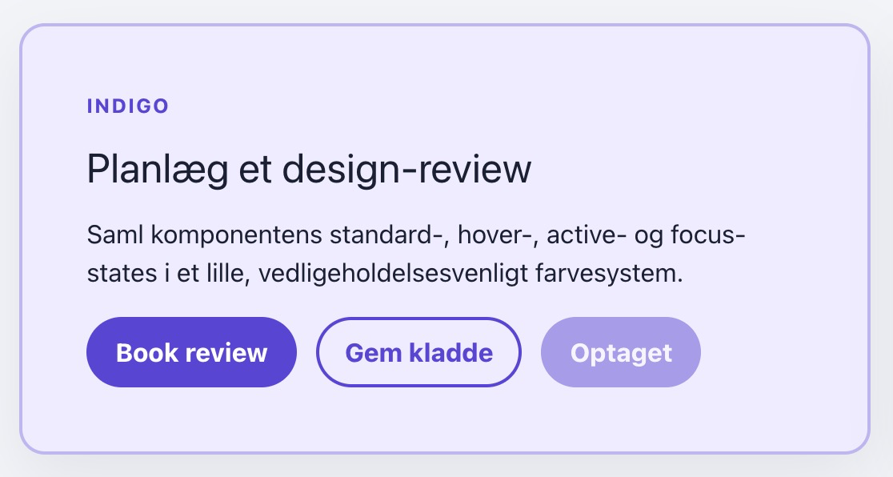

# Relative Color Syntax — states fra ét token

## Formål

At bruge **Relative Color Syntax** til at aflede meningsfulde UI-states fra en eksisterende farve i stedet for at vedligeholde en samling løsrevne farveværdier.

Øvelsen træner samtidig kontrast, fokusmarkering og en systematisk tilgang til kanalerne i OKLCH.

## Ressourcer

1. [MDN: Using relative colors](https://developer.mozilla.org/en-US/docs/Web/CSS/CSS_colors/Relative_colors)
2. [WebAIM Contrast Checker](https://webaim.org/resources/contrastchecker/)

## Opgavebeskrivelse

Du får to action-komponenter med hvert sit `data-theme`. Hvert tema definerer kun `--color-brand`, mens de afledte farvetokens står tomme på `.action-card`.

Billedet ovenfor viser retningen for den færdige komponent. Når du udfylder de fælles farvetokens, skal begge kort automatisk få et sammenhængende farvesystem.

Arbejd i `style.css` og løs TODO-markeringerne.

1. Brug `oklch(from var(--color-brand) l c h)` til at aflede:
   - `--color-brand-hover`
   - `--color-brand-active`
   - `--color-brand-muted`
   - `--color-brand-border`
   - `--color-brand-focus`
   - `--color-brand-on-muted`
2. Placér den fælles state-logik på `.action-card`, så begge komponenter reagerer på deres eget `--color-brand`.
3. Behold som udgangspunkt brandfarvens hue, og justér primært lightness og chroma.
4. Kontrollér kontrast for tekst, knapper og fokusmarkering.

## En enkel tilgang

Tænk på kanalerne sådan:

- `l` styrer, hvor lys eller mørk farven er. Træk lidt fra til hover og mere fra til active.
- `c` styrer farvens intensitet. Gang den ned til rolige surfaces og borders.
- `h` er selve farveretningen. Behold den normalt, så alle states stadig opleves som samme brand.

Brug dette som startskud, ikke som et facit:

- hover: træk cirka `0.04–0.08` fra `l`
- active: træk cirka `0.10–0.16` fra `l`
- muted surface: brug en høj lightness omkring `0.94–0.98`, og behold cirka `10–20 %` af chroma
- focus og `on-muted`: gør dem mørke nok til tydelig kontrast, og kontrollér resultatet med en contrast checker

Når du sammenligner to brands, er det lettest at vælge forskellige hues med nogenlunde samme lightness. Så tester du farveretningen uden samtidig at blande meget lyse og meget mørke brands ind i opgaven.

Målet er ikke at gøre alle farver matematisk relative. Neutrale farver og semantisk særskilte farver må fortsat være selvstændige tokens.

## Defensive tests

- Skift Coral-kortets `--color-brand` til en anden hue med nogenlunde samme lightness.
- Test hover, active, keyboard focus og disabled.
- Kontrollér, at du kun behøver at ændre `--color-brand` for at opdatere hele komponenten.
- Kontrollér kontrasten for hvid tekst på den fyldte knap, `on-muted`-tekst og focus-ring.

## Specifikke mål

- Forstå kanalerne i `oklch(from <color> l c h)`.
- Kunne aflede states fra ét semantisk token.
- Kunne forklare, hvorfor lightness typisk justeres med plus/minus, mens chroma ofte skaleres.
- Kunne afgøre, hvornår en farve **ikke** bør afledes.

## Aflevering

Aflever et link til din løsning.

> [!NOTE]
> Branchen indeholder et lille CSS Reset via `resources/starter.css`.
